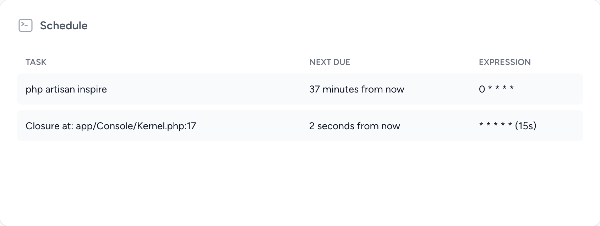

# Laravel Pulse - Schedule

Laravel Pulse card that list all scheduled tasks.



## Installation

You can install the package via composer:

```sh
composer require hosmelq/laravel-pulse-schedule
```

## Usage

To add the card to the Pulse dashboard, you must first [publish](https://laravel.com/docs/10.x/pulse#dashboard-customization) the dashboard view.

```sh
php artisan vendor:publish --tag=pulse-dashboard
```

You can now add the card.

```html
<x-pulse>
    ...

    <livewire:pulse.schedule cols="8" />

    ...
</x-pulse>

```


## Credits

- [Hosmel Quintana](https://github.com/hosmelq)
- [All Contributors](../../contributors)

The majority of the code has been taken from [here](https://github.com/laravel/framework/blob/10.x/src/Illuminate/Console/Scheduling/ScheduleListCommand.php).

## License

The MIT License (MIT). Please see [License File](LICENSE) for more information.
